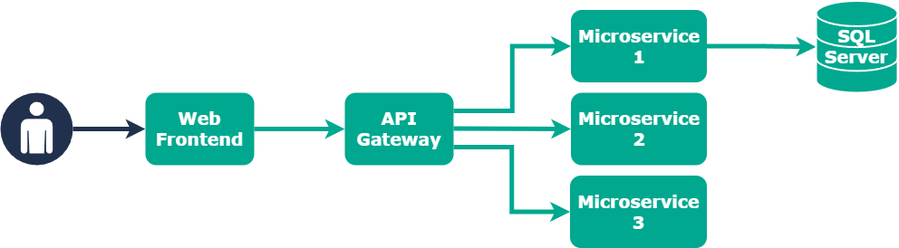

# Microservices - Whiteboarding Test

## Introduction

Welcome to the Trainline Microservices Whiteboarding test.

This will be a 45-60 minute exercise in which we will ask you to consider different scenarios associated to the system diagram below.

Please spend some time familiarising yourself with the diagram and context so that you are fully prepared on the day.

Good luck! 😃

---

## Context

What you are looking at is a simple web application architecture with a front-end application that talks to a set of back-end microservices via an API gateway.

One such service has a SQL Server database that stores data relevant to that specific microservice.

## Diagram

